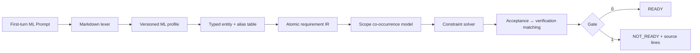

# Prompt Grammar

> 面向机器学习研究与 Coding Agent 的确定性首轮 Prompt 就绪门禁。


[快速开始](#快速开始) · [Grammar v2](#grammar-v2) · [诊断](#诊断模型) ·
[测试证据](#测试与证据) · [English](#english-overview)

Prompt Grammar 把用户第一次给出的 ML 任务说明视为一份可静态检查的接口：
自由文本负责表达意图与背景，真正影响执行的决策、约束、实验条件和验收标准则进入一个小型受控语言。验证器先构建类型化中间表示，再以确定性规则返回
`READY` 或带源码位置的 `NOT_READY`。

它解决的是一个工程问题：在 Agent 开始规划、改代码或运行实验前，确认“已表达的 ML 规格”结构完整、内部一致、关键问题没有被静默代答，并且验收结果有明确的观察方式。

> [!IMPORTANT]
> `READY` 不是“任意自然语言 Prompt 已被证明正确”。它只证明文档符合版本化 ML profile，且进入受控语法的内容通过了确定性检查。事实真实性、隐藏在 prose 中的矛盾、未声明的领域需求和最终执行结果仍需外部证据。

## 为什么需要它

Coding Agent 面对缺失信息时往往会继续工作，并选择一个看似合理的默认值。普通软件任务里这可能只是返工；ML 任务里，它可能悄悄改变 dataset split、baseline、control variable、seed、checkpoint、metric 或 evaluation protocol。代码可以运行，指标也可以看起来合理，但实验已经失去可比性。

Prompt Grammar 的原则是：

- 高影响选择必须由用户明确决定、显式委托，或作为阻塞问题返回；
- 一个原子 requirement 只表达一个可判定事实；
- 不用 LLM 再主观判断同一个 Prompt 是否“足够好”；
- 验收断言与验证手段分离；
- 只声明真正实现和测试过的能力边界。

## 当前能力

| 能力 | Grammar v2 行为 |
|---|---|
| ML 模式完整性 | 检查 `RESEARCH`、`IMPLEMENT`、`MODIFY`、`DEBUG`、`EVALUATE` 的条件必填字段 |
| 类型系统 | `integer`、`number`、`boolean`、`string`、`path`、`enum`、`any` |
| 实体与同义名 | 显式 alias 归一化；检测 alias collision 和未知 subject |
| 条件作用域 | 显式 `overlaps` / `excludes`；关系未知时阻塞，而不是猜测 |
| 约束求解 | 等值、不等值、数值区间、集合包含/排除与多行空域检测 |
| ML 语义槽位 | 研究变量、control、training、evaluation、metrics、seeds 使用 ML canonical subject |
| 高影响问题 | `[HIGH]` 阻塞；`[LOW]` 保留但不阻塞 |
| 验收可观察性 | 每个 acceptance atom 必须映射到 command/artifact/metric/observation 计划 |
| 工程接口 | 稳定退出码、文本/JSON 输出、源码行号与关联冲突行 |
| 兼容性 | 无 `GRAMMAR_VERSION` 的既有文档继续使用 v1 语义 |

## 不做什么

本项目当前只针对机器学习研究与编码任务，不承诺覆盖医疗、金融、法律或任意业务需求。验证器也不会：

- 判断 `CURRENT_STATE`、论文、数据或指标是否真实；
- 理解并证明两段任意 prose 是否矛盾；
- 猜测未声明的 alias、单位或条件关系；
- 执行 `VERIFICATION_PLAN` 中的命令；
- 检查 artifact 当前是否存在；
- 保证实现最终满足 acceptance；
- 用一个不可解释的 LLM 分数替代硬规则。

跨领域扩展方案被单独保存在
[Cross-domain Porting Notes](docs/cross-domain-porting-notes.md)，不会混入当前 ML profile 的产品声明。

## 架构



运行时 Skill 保持为薄入口，只说明何时调用 linter、如何处理两个状态以及能力边界。完整语法、研究依据和测试报告按需加载，因此不会在每个 Agent 回合重复消耗大量 context。

## 快速开始

要求：Python 3.11 或更高版本。linter 只使用标准库。

```bash
git clone https://github.com/Zhangjianqiao-jp/Prompt-grammar-constrain.git
cd Prompt-grammar-constrain

python3 .agents/skills/prompt-readiness-gate/scripts/prompt_lint.py \
  examples/ml-implement-v2.md
```

预期输出：

```text
READY
```

检查 JSON 接口：

```bash
python3 .agents/skills/prompt-readiness-gate/scripts/prompt_lint.py \
  examples/ml-research-v2.md --format json
```

```json
{
  "status": "READY",
  "grammar_version": 2,
  "profile_version": 2,
  "mode": "RESEARCH",
  "issues": [],
  "atomic_requirement_count": 10
}
```

退出码：

- `0`：`READY`；
- `1`：`NOT_READY`；
- `2`：输入或 profile 无法读取。

## 选择模板

| 场景 | 模板 |
|---|---|
| 正式 ML 研究、评估、调试或重要修改 | [完整模板](templates/ml-research-coding-prompt.md) |
| 小型 `IMPLEMENT` 任务 | [紧凑模板](templates/ml-research-coding-prompt-compact.md) |
| 可直接运行的研究例子 | [RESEARCH example](examples/ml-research-v2.md) |
| 可直接运行的实现例子 | [IMPLEMENT example](examples/ml-implement-v2.md) |

完整模板包含所有模式的栏目。使用时先选择一个 `MODE`，删除其他模式专属栏目，再声明实际使用的实体、scope 和 verification plan。模板占位符本身不会被当作有效内容。

## Grammar v2

### 1. 文档骨架

```text
GRAMMAR_VERSION: 2
MODE: IMPLEMENT

TASK:
Add deterministic checkpoint cache keys.

GOAL:
Prevent collisions between model revisions.

CURRENT_STATE:
The cache key omits model revision.
```

所有模式都需要 `TASK`、`GOAL`、`CURRENT_STATE`、`OUTPUT` 和原子化 `ACCEPTANCE`。

| MODE | 额外必填内容 |
|---|---|
| `RESEARCH` | `HYPOTHESIS`；`VARIABLE`、`CONTROL`、`TRAINING`、`EVALUATION`、`METRICS`、`SEEDS` |
| `IMPLEMENT` | 无额外模式栏目 |
| `MODIFY` | `MAY_CHANGE`、`MUST_PRESERVE` |
| `DEBUG` | `EXPECTED`、`OBSERVED`，以及 `REPRODUCTION` / `EVIDENCE` 至少一个 |
| `EVALUATE` | `TARGET`、`PROTOCOL`、`METRICS` |

### 2. 实体、类型与 alias

```text
ENTITIES:
- data.split : enum aliases ["dataset.partition"]
- gpu.count : integer
- metric.accuracy : number
- tests.failed : integer
```

所有原子约束和 verification target 必须先声明。Alias 在冲突检查前归一化，因此下面两行会被识别为同一实体上的矛盾：

```text
- [eval] data.split = validation
- [eval] dataset.partition = test
```

### 3. Scope 与条件共现

```text
SCOPES:
- train
- eval
- result
- train excludes eval
- eval overlaps result
```

- `*` 是隐式全局 scope，与每个命名 scope 组合；
- `overlaps` 表示两个条件可能同时成立，约束共同求解；v2 中按传递关系形成保守共现族；
- `excludes` 表示条件互斥，约束独立求解；
- 同一 canonical subject 跨 scope 出现但关系未知时，返回 `AMBIGUOUS_SCOPE`。

这个规则修复了 v1 把不同 scope 一律视为独立所导致的潜在假阴性。

### 4. 原子 requirement

```text
- [scope] subject OP value
```

支持的 `OP`：`=`、`!=`、`<`、`<=`、`>`、`>=`、`in`、`not-in`。

```text
DECISIONS:
- [*] data.split = validation

CONSTRAINTS:
COMPUTE:
- [train] gpu.count <= 4
MODEL:
- [train] precision in ["fp16", "bf16"]

DON'T:
- [*] data.test_leakage = false
```

带空格的字符串必须使用 JSON 引号；`in` / `not-in` 的值必须是非空 JSON 标量数组。一个原子行只表达一个约束，不要把条件藏在 prose 中。

### 5. Acceptance 与 verification

```text
ACCEPTANCE:
ENGINEERING:
- [result] tests.failed = 0
- [result] metric.accuracy >= 0.90

VERIFICATION_PLAN:
- [result] tests.failed <- command:"python3 -m unittest"
- [result] metric.accuracy <- artifact:"artifacts/metrics.json"
```

`ACCEPTANCE` 描述期望的未来状态；`VERIFICATION_PLAN` 描述如何观察它。支持 `command`、`artifact`、`metric`、`observation` 四种证据类型。静态门禁只检查映射是否完整，不会执行或信任 locator。

### 6. 问题与委托

```text
DELEGATED:
- [implementation] helper.naming delegated

OPEN_QUESTIONS:
- [HIGH] data.split — Which split is authoritative?
- [LOW] logging.format — JSON or text?
```

`HIGH` 是硬阻塞。Validator 不会为了让文档通过而替用户选择数据、baseline、metric、scope 或验收阈值。

完整规范与 EBNF 见
[ML Prompt Grammar v2 Contract](.agents/skills/prompt-readiness-gate/references/contract.md)。

## 诊断模型

错误包含稳定的类别、section、主源码行和相关行。例如：

```text
NOT_READY
[CONTRADICTION] DECISIONS prompt.md:21 — constraints for 'data.split'
are unsatisfiable in scope 'eval'; related lines 22
```

主要诊断：

| Code | 含义 |
|---|---|
| `MISSING` | 必填 section 或 substantive value 缺失 |
| `SYNTAX` | section、原子行、entity、scope 或 evidence 语法错误 |
| `UNSUPPORTED_VERSION` | Grammar 版本不受支持 |
| `UNKNOWN_ENTITY` / `UNKNOWN_SCOPE` | 使用了未声明的 symbol |
| `TYPE_MISMATCH` | 值或 operator 与声明类型不一致 |
| `ALIAS_COLLISION` | 一个 alias 被映射到多个 canonical entity |
| `AMBIGUOUS_SCOPE` | 同一 subject 跨 scope，但共现关系没有声明 |
| `CONTRADICTION` | 约束交集为空 |
| `ML_SEMANTIC_SLOT` | ML 专属栏目没有使用要求的 canonical subject family |
| `UNRESOLVED` | 高影响问题未解决 |
| `UNVERIFIABLE` | acceptance 不是原子断言 |
| `MISSING_EVIDENCE` | acceptance 没有匹配的 verification plan |
| `REDUNDANT` | 重复 requirement；warning，不阻塞 |

## Skill 集成

仓库内 Skill 位于
[`.agents/skills/prompt-readiness-gate`](.agents/skills/prompt-readiness-gate)。支持项目级 skills 的 Agent runtime 可以直接发现它；其他 runtime 可将该目录复制到相应的 skill 搜索路径。

Skill 的执行协议非常短：保存用户原始首轮 ML 规格、运行确定性 linter、在 `NOT_READY` 时只返回定位诊断并停止、在 `READY` 时继续执行原规格。研究说明和完整 contract 不进入正常验证上下文，只有用户需要修复格式或追溯设计时才加载。

当前 `SKILL.md` 仅 15 行；使用 `o200k_base` 实测为 209 tokens（`cl100k_base` 为 210），其余内容通过 progressive disclosure 按需读取。

## 测试与证据

测试策略参考 requirements engineering、compiler testing 和 test-oracle 研究，当前包含：

- 行为与 profile 单元测试；
- v1 → v2 兼容回归；
- 5,000 个有限域约束系统与独立穷举 oracle 对照；
- permutation、duplication、rename 等 metamorphic properties；
- 3,000 个 seeded Unicode/ASCII fuzz 文档与超长输入；
- alias、type、scope、evidence 的 v2 mutation tests；
- 2,000-case、5% 缺陷率的不平衡合成 benchmark；
- statement coverage 与两版 Python 回归。

复现：

```bash
python3 -m unittest discover \
  -s .agents/skills/prompt-readiness-gate/tests -v

python3 .agents/skills/prompt-readiness-gate/tests/run_benchmark.py
```

2026-08-22 的当前结果：

| 项目 | 结果 |
|---|---:|
| 测试 | 61 passed on Python 3.11.11, 3.12.8, and 3.13.1 |
| 独立 solver oracle | 5,000 / 5,000 matched |
| fuzz | 3,000 deterministic, crash-free |
| core linter statement coverage | 97% (692 statements, 19 missed) |
| benchmark | TP 100 · FP 0 · TN 1900 · FN 0 |
| benchmark precision / recall / F1 | 1.0 / 1.0 / 1.0 |
| 实测吞吐 | 约 6,024 prompts/s |

> [!CAUTION]
> Benchmark 是固定 mutation operators 生成的 in-contract 合成集。完美分数是规则实现正确性的回归证据，不是对真实用户 Prompt 的外部准确率声明。要证明现实有效性，还需要冻结真实首轮 ML Prompt corpus、双人盲标与一致性统计、held-out 评估，以及 `READY` 对下游任务成功率的预测实验。

完整方法、coverage 与 validity threats 见
[Validation Report](.agents/skills/prompt-readiness-gate/references/validation.md)。

## 版本与兼容策略

| 输入 | 行为 |
|---|---|
| 无 `GRAMMAR_VERSION` | 按 v1 解析，保留既有模板兼容性 |
| `GRAMMAR_VERSION: 1` | 显式 v1 |
| `GRAMMAR_VERSION: 2` | 严格实体、类型、scope 与 verification 语义 |
| 其他版本 | `UNSUPPORTED_VERSION`，不降级猜测 |

Grammar/profile 的意义变化必须提升版本。新的规则不得静默改变旧 profile 的语义；每个受支持版本都应保留 migration fixtures。

## 安全与信任边界

- Linter 只读取 prompt 与 JSON profile，不联网、不执行 prompt 中的命令；
- `VERIFICATION_PLAN` locator 被当作字符串，不是授权；
- JSON 输出适合 CI，但不能替代 sandbox、code review、测试、实验追踪或访问控制；
- 极长字符串已做鲁棒性测试，但当前没有独立的文件大小限制；不应把不受信任的大文件直接暴露给服务端接口；
- 自定义 profile 属于受信任配置，生产环境应做版本固定和代码审查。

## 仓库结构

```text
Prompt-grammar-constrain/
├── README.md
├── examples/                         # 可直接 lint 的 v2 样例
├── templates/                        # 完整与紧凑 ML 模板
├── docs/
│   └── cross-domain-porting-notes.md # 后续领域复用笔记
└── .agents/skills/prompt-readiness-gate/
    ├── SKILL.md                       # 低 token 运行入口
    ├── profiles/ml-research.json      # ML profile v2
    ├── scripts/prompt_lint.py         # 零依赖 parser + checker
    ├── tests/                         # unit/property/fuzz/benchmark
    └── references/
        ├── contract.md                # 正式 grammar contract
        ├── design-basis.md            # 相关工作与设计依据
        └── validation.md              # 测试证据与有效性边界
```

## 路线图

近期 ML 范围：

- 建立匿名化的真实 first-turn ML prompt corpus；
- 双 reviewer 标注、Cohen's kappa 与 per-defect confidence interval；
- 比较 no-gate、LLM-only gate、Grammar v1/v2 的下游效果；
- 增加 project-level ML ontology overlay 和单位类型；
- 为批准的 command/artifact 增加独立 runtime verifier；
- 引入 traceability ID，连接 prompt、plan、code、experiment 与 evidence。

跨领域工作不会直接扩张当前 ML profile；见
[复用笔记](docs/cross-domain-porting-notes.md)。

## 研究依据

设计并非来自“多写几个 Prompt 提示词”，而是综合了 controlled natural language、需求工程、静态分析与 executable specification：

- [CNL-P: controlled prompt linting](https://arxiv.org/abs/2508.06942)
- [IBM Prompt Declaration Language](https://github.com/IBM/prompt-declaration-language)
- [Microsoft POML](https://github.com/microsoft/poml)
- [Prompt underspecification](https://arxiv.org/abs/2505.13360)
- [EARS requirements syntax](https://doi.org/10.1109/RE.2009.9)
- [ALICE requirement contradiction detection](https://link.springer.com/article/10.1007/s10515-024-00452-x)
- [Requirements NLI lessons](https://arxiv.org/abs/2405.05135)
- [RFC 2119 normative requirements](https://datatracker.ietf.org/doc/rfc2119/)
- [Gherkin executable specifications](https://cucumber.io/docs/gherkin/reference/)
- [NASA Systems Engineering Handbook](https://www.nasa.gov/reference/systems-engineering-handbook/)
- [GitHub Spec Kit](https://github.github.com/spec-kit/)
- [JSON Schema conditional validation](https://json-schema.org/understanding-json-schema/reference/conditionals)

研究如何影响具体设计，见
[Design Basis](.agents/skills/prompt-readiness-gate/references/design-basis.md)。

## 贡献

最有价值的贡献不是新增更多 prose 规则，而是可复现证据：

- 真实、匿名化的 ML 首轮 Prompt 与 reviewer 标签；
- validator 漏报、误报或过度阻塞的最小案例；
- alias / scope / multi-line contradiction 的 adversarial fixtures；
- ML 高影响决策槽位与 observability 规则；
- benchmark、mutation operator 和 downstream outcome 设计。

新增 hard rule 时，请同时提交：清晰的语义、正反例、稳定诊断、单元测试、至少一个 mutation，以及对兼容性和 token/context 成本的说明。

## English overview

Prompt Grammar is a deterministic pre-execution gate for first-turn machine-learning research and coding prompts. Grammar v2 parses a controlled Markdown contract into typed entities, explicit aliases, scoped atomic constraints, ML-specific semantic slots, and acceptance-to-verification mappings. It returns `READY` or line-addressed `NOT_READY` diagnostics without asking an LLM to grade the prompt.

The scope is intentionally narrow: ML tasks only. `READY` proves conformance and represented consistency, not factual truth, prose-level semantic completeness, artifact existence, or downstream implementation success.

Start with the [full template](templates/ml-research-coding-prompt.md), the
[compact IMPLEMENT template](templates/ml-research-coding-prompt-compact.md), or a runnable
[RESEARCH example](examples/ml-research-v2.md). The formal syntax is in the
[v2 contract](.agents/skills/prompt-readiness-gate/references/contract.md), and evaluation evidence is documented in the
[validation report](.agents/skills/prompt-readiness-gate/references/validation.md).

## Disclaimer

Prompt Grammar is an experimental requirements-validation tool. It does not replace software tests, experiment tracking, statistical review, code review, access controls, sandboxing, or domain-expert judgment.
